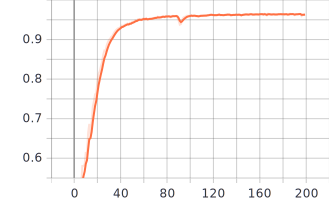

# [Graph Attention Networks](https://arxiv.org/abs/1710.10903)(GAT) Pytorch implementation
This repo contains two types of implementation:
* Basic GAT: simple, easy to grab the concept, heavily borrow from [pyGAT, Diego Antognini](https://github.com/Diego999/pyGAT)
* Efficient GAT: efficient, takes time to interpret some matrix operations, heavily borrow from [pytorch-GAT, Aleksa Gordić](https://github.com/gordicaleksa/pytorch-GAT)


## Basic GAT, CORA
* Normal run
```bash
python train_cora.py
```
It takes around 27.8s to run on a Titian Xp (83% util), best test results: ```loss=0.6526, accuracy=0.8420```

* Sparse run
```bash
python train_cora.py --sparse
```
Longer execution time: 69.3s (1:0.4), lower GPU-Util: 33% (0.4:1), same results (with fixed seed).


## GAT, PPI
```bash
python train_ppi.py --cuda_idx 2 --ppi_path './data/ppi' --enable_tensorboard \
    --checkpoint_freq 50 --should_test
```
Finish in 490 secs (200 epochs), test micro-F1 score: 0.973. \
Validation micro f1 score curve:
<p align="center">

</p>


## Reference
* [pyGAT, Diego Antognini](https://github.com/Diego999/pyGAT), simple implementation at CORA dataset
* [pytorch-GAT, Aleksa Gordić](https://github.com/gordicaleksa/pytorch-GAT), efficient implementation at PPI dataset
* [Official GAT repo, Petar Veličković](https://github.com/PetarV-/GAT), provides a general index map