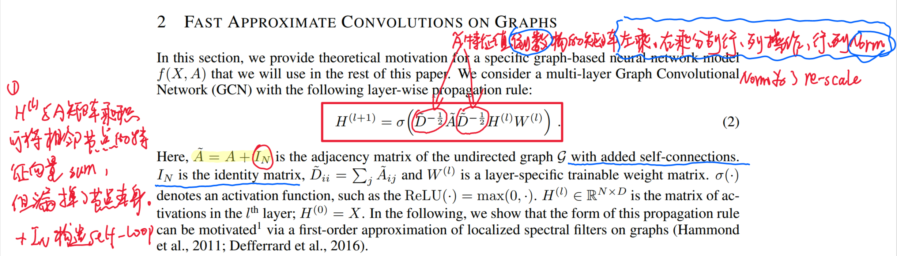

# GCNs with Fast Approximate Convolutions
Pytorch implementation of paper [SEMI-SUPERVISED CLASSIFICATION WITH GRAPH CONVOLUTIONAL NETWORKS](http://arxiv.org/abs/1609.02907)

## Key contributions
Introduce a novel **fast approximate convolutions** illustrated below.

<p align="center">

</p>

## Usage
```bash
python train.py
```

## References
* [Offical Pytorch implementation of the paper](https://github.com/tkipf/gcn).
* [GCNs Blog](http://tkipf.github.io/graph-convolutional-networks/) by Thomas N. Kipf.
* Distill paper: [A Gentle Introduction to Graph Neural Networks](https://distill.pub/2021/gnn-intro/), which provides a general view for GNNs.
* Distill paper: [Understanding Convolutions on Graphs](https://distill.pub/2021/understanding-gnns/), which briefly introduce the underlying mechanism of GNNs.
